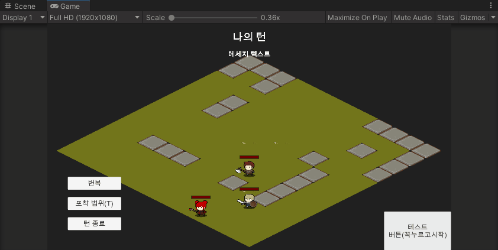
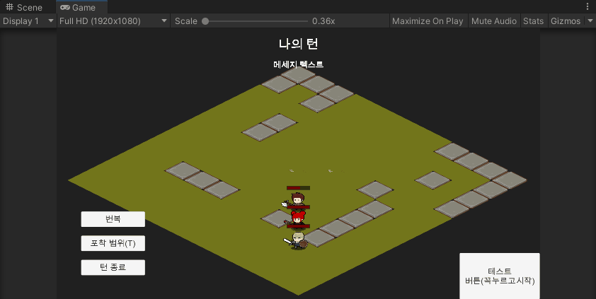
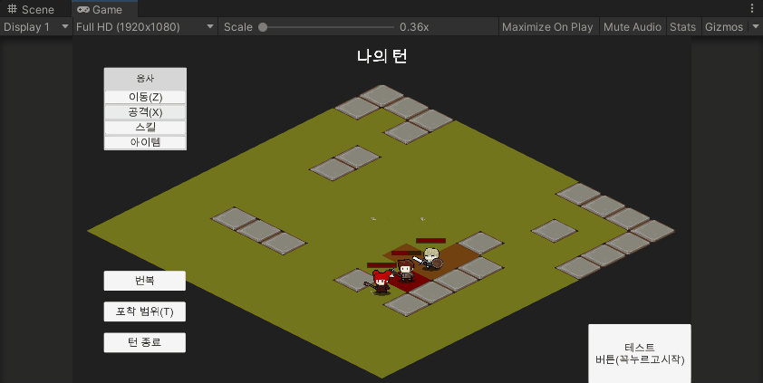
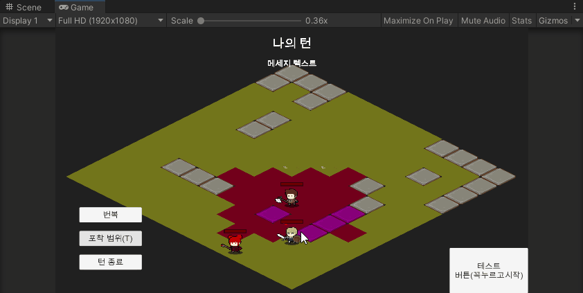

# mini-tactics
 A isometric 2D turn based game

### Features
- Pathfinding system using graph search algorithm
- Tile based Isometric 2D graphics
- Rough AI System with adjustable parameter using the ScriptableObject
- Turn based game rule

### Screenshots
  
  
  
  
  
